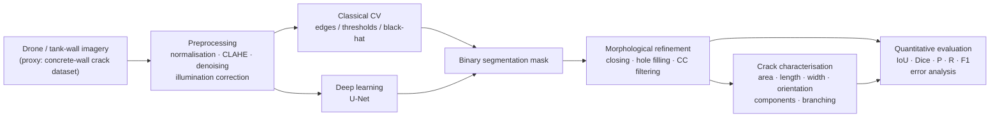
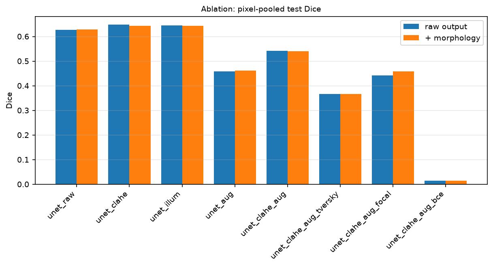

# Drone-Based Crack Inspection of Chemical Tank Walls

An end-to-end, research-oriented computer-vision pipeline for **UAV/drone visual inspection of chemical tank walls**:
crack detection, semantic segmentation, morphological refinement and quantitative crack characterisation,
with classical computer vision and deep learning investigated side by side.




---

## Contents

1. [Problem statement](#1-problem-statement) · 2. [Motivation](#2-motivation) · 3. [Confidentiality and proxy dataset](#3-confidentiality-limitation-and-proxy-dataset)
4. [Dataset setup](#4-dataset-setup) · 5. [Annotation](#5-annotation-procedure) · 6. [Preprocessing](#6-preprocessing) · 7. [Photometric variation](#7-photometric-variation)
8. [Classical CV](#8-classical-cv-methodology) · 9. [Deep learning](#9-deep-learning-methodology) · 10. [Semantic segmentation](#10-semantic-segmentation)
11. [Morphological refinement](#11-morphological-refinement) · 12. [Crack characterisation](#12-crack-characterisation) · 13. [Metrics](#13-evaluation-metrics)
14. [Experimental setup & results](#14-experimental-setup-and-results) · 15. [Ablations](#15-ablation-studies) · 16. [Error analysis](#16-error-analysis)
17. [Laptop workflow](#17-local-laptop-workflow) · 18. [Kaggle workflow](#18-kaggle-gpu-workflow) · 19. [Limitations](#19-limitations) · 20. [Future work](#20-future-work)

---

## 1. Problem statement

Given an image of a tank wall captured by a UAV, localise cracks at pixel level, clean up the segmentation, and
turn the mask into inspection-relevant measurements (area, length, width, orientation, number of cracks, branching).
The pipeline must be evaluated quantitatively, and its sensitivity to preprocessing, illumination, augmentation,
loss function and post-processing must be understood.

## 2. Motivation

Manual inspection of chemical storage tanks is slow, hazardous and subjective. Drones can acquire wall imagery
cheaply, but drone imagery suffers from uneven illumination, shadows, reflections, low contrast and varying camera
pose. A robust, measurable crack-analysis pipeline is a prerequisite for automated condition monitoring.

## 3. Confidentiality limitation and proxy dataset

The target imagery is confidential. Access is limited
## 4. Dataset setup
* Dataset was manually annotated using CVAT, however public dataset was also combined to increase sample size and generalizability.
* **Full dataset**: attach *segmentation* dataset (images + pixel masks) to the
  notebook and point `dataset.path` at it. The loader (`src/data/dataset.py`) discovers any `images`/`masks`
  sibling folders recursively, so no re-organisation of the download is needed.
* Split: stratified 80/10/10 train/val/test with a fixed seed (`splits.json` is saved with each run); a predefined
  `test/` folder is respected if present. The test split is only used in `scripts/evaluate.py`.

```
python scripts/explore_dataset.py          # counts, mask statistics, sample grid -> results/dataset/
```

Dataset facts (local samples): crack pixels cover 0.8 % of an image on average (median 0.4 %, max 6.3 %).

## 5. Preprocessing

`src/preprocessing/ops.py` provides composable ops (all RGB-in / RGB-out):
normalisation (min-max, standardisation, RGB chromaticity), contrast (histogram equalisation, CLAHE), denoising
(Gaussian, median, bilateral), illumination correction (gamma, auto-gamma, local contrast normalisation, background
estimation by large morphological closing + division, single-scale Retinex). Presets: `raw`, `normalized`,
`contrast`, `illumination`, `retinex`, `combined`.

Rather than assuming preprocessing helps, `scripts/preprocess.py` measures **crack/background separability**
(Fisher ratio between crack- and background-pixel intensities, using the GT mask) for each preset
(`results/preprocessing/`):

| preset | steps | Fisher ratio | ms/img |
|---|---|---|---|
| raw | – | 1.055 | 0.0 |
| normalized | min-max | 1.054 | 3.7 |
| contrast | CLAHE | 1.054 | 0.5 |
| illumination | background correction | **1.218** | 29.2 |
| retinex | SSR | 1.029 | 12.2 |
| combined | background corr. + CLAHE + bilateral | **1.326** | 41.8 |

CLAHE raises visual contrast but not separability (it amplifies background texture as much as cracks);
illumination correction does raise it. Before/after figures: `results/preprocessing/before_after_*.png`.

## 6. Photometric variation

`src/preprocessing/perturbations.py` simulates brightness ±60, contrast ×0.5/×1.6, gamma 0.5/2.2, cast shadow,
local illumination (spotlight), colour shift and low-light noise. Only the image is changed; the mask is untouched.

Separability (Fisher ratio) under perturbation, with and without preprocessing (first 40 positives):

| perturbation | raw | CLAHE | illumination corr. | combined |
|---|---|---|---|---|
| original | 1.13 | 1.11 | 1.23 | 1.37 |
| shadow | **0.22** | 0.48 | **1.10** | 1.20 |
| local illumination | **0.25** | 0.60 | **1.21** | 1.30 |
| gamma 2.2 | 1.13 | 0.90 | 1.25 | 1.15 |
| low-light noise | 0.50 | 0.38 | 0.52 | 0.69 |

Shadows and spotlights destroy separability of raw images; background-illumination correction almost fully restores
it. Noise is not fixed by any of the presets. End-to-end robustness of the detectors is measured by
`scripts/photometric_experiment.py` (section 14).

## 7. Classical CV methodology

`src/classical_cv/pipeline.py`: preprocessing preset → detector → morphology → connected-component filtering.
Detectors: Canny, Sobel, Laplacian (dark-ridge), global threshold, Otsu, adaptive threshold, black-hat + Otsu,
black-hat + fixed threshold. CPU only; per-image time is recorded.

`python scripts/classical_cv.py --split all` runs the grid below on the 199 local samples
(`results/classical_cv/`). Mean per-image metrics; "crack-only Dice" restricts to images containing a crack,
"pooled Dice" is computed from pixel counts pooled over all images.

| experiment | preprocessing | detector | morphology | IoU | Dice | Prec | Rec | crack-only Dice | pooled Dice | ms |
|---|---|---|---|---|---|---|---|---|---|---|
| E1 | raw | Canny | – | 0.045 | 0.080 | 0.082 | 0.121 | 0.155 | 0.062 | 0.6 |
| E2 | CLAHE | Canny | – | 0.009 | 0.018 | 0.010 | 0.162 | 0.034 | 0.019 | 2.1 |
| E3 | illumination | Canny | – | 0.045 | 0.080 | 0.084 | 0.121 | 0.157 | 0.062 | 30.8 |
| E4 | CLAHE | adaptive | – | 0.017 | 0.032 | 0.017 | 0.359 | 0.062 | 0.034 | 1.9 |
| E5 | CLAHE | Canny | close 5 | 0.011 | 0.021 | 0.011 | 0.443 | 0.040 | 0.021 | 2.0 |
| E6 | combined | adaptive | open 3, close 5, CC≥80 | 0.039 | 0.070 | 0.041 | 0.386 | 0.137 | 0.062 | 44.5 |
| E7 | raw | Otsu | – | 0.016 | 0.031 | 0.016 | 0.433 | 0.060 | 0.037 | 0.3 |
| E8 | raw | Sobel | – | 0.041 | 0.075 | 0.052 | 0.167 | 0.146 | 0.089 | 2.5 |
| E9 | raw | Laplacian | – | 0.032 | 0.059 | 0.042 | 0.119 | 0.114 | 0.071 | 2.2 |
| E10 | raw | black-hat + Otsu | – | 0.022 | 0.039 | 0.023 | 0.404 | 0.076 | 0.042 | 1.1 |
| E11 | CLAHE | black-hat + Otsu | close 5, CC≥80 | 0.012 | 0.023 | 0.012 | 0.492 | 0.044 | 0.026 | 3.2 |
| E12 | combined | black-hat + Otsu | close 5, CC≥80 | 0.020 | 0.036 | 0.021 | 0.471 | 0.070 | 0.035 | 44.8 |
| E13 | raw | black-hat, fixed thr. | close 5, CC≥80 | 0.110 | 0.161 | 0.189 | 0.278 | 0.274 | 0.073 | 2.3 |
| **E14** | illumination | black-hat, fixed thr. | close 5, CC≥80 | **0.117** | **0.168** | 0.199 | 0.281 | **0.278** | 0.072 | 32.4 |

Findings: (i) classical methods are dominated by false positives on textured, crack-free surfaces (the gap between
crack-only and overall Dice); (ii) CLAHE *hurts* every classical detector because it amplifies background texture;
(iii) the black-hat transform with an absolute threshold is the strongest classical detector, and illumination
correction gives it a small further gain; (iv) all classical methods run in a few ms on CPU.

## 8. Deep-learning methodology

* **Model**: U-Net (`src/models/unet.py`, configurable `base_channels`/`depth`, registry for future U-Net++/DeepLabV3/SegFormer).
* **Losses** (`src/training/losses.py`): BCE, Dice, BCE+Dice (default), Focal, Tversky, Focal-Tversky.
* **Augmentation** (`src/training/augmentation.py`, OpenCV only): geometric (h/v flip, rotation, scale, perspective) applied
  identically to image and mask; photometric (brightness, contrast, gamma, noise, blur, colour shift) to the image only.
  Every op has a configurable probability.
* **Training** (`src/training/trainer.py`): AdamW/Adam, ReduceLROnPlateau/cosine, early stopping, best-checkpoint on
  validation Dice (or IoU), CSV + JSON logs, AMP on GPU, automatic CUDA/CPU detection with GPU name report.

## 9. Semantic segmentation

Input H×W×3 → sigmoid probability map H×W×1. `scripts/evaluate.py` sweeps thresholds 0.1–0.9 (plots
`threshold_sweep.png`, `pr_curve.png`) instead of assuming 0.5, and reports both. `scripts/predict.py` writes the
probability map, binary mask, refined mask, overlay and measurements for one image.

## 10. Morphological refinement

`src/postprocessing/morphology.py`: probability → threshold → opening/closing → hole filling → small-component
removal → optional gap closing / dilation / erosion (all configurable under `postprocessing:` in the config).
Every evaluation reports **raw** and **refined** rows so the effect of refinement is always measured
(before/after figure: `qualitative_examples/raw_vs_refined.png`).

## 11. Crack characterisation

`src/characterization/crack_metrics.py` extracts from a binary mask: area (px), centre-line length (skeleton,
diagonal steps weighted √2), mean/max width (2 × distance transform sampled on the skeleton), dominant orientation
(PCA of crack pixels, degrees from horizontal), number of connected components, density, branch points (skeleton
junction clusters), end points and per-component aspect ratio (min-area rectangle). All units are **pixels**; no
calibration is assumed. Output example (`results/characterization/measurements.md`):

| image | area px | length px | mean width px | max width px | orientation ° | components | branch pts |
|---|---|---|---|---|---|---|---|
| CFD_001 | 2403 | 641.3 | 4.35 | 8.79 | 6.5 | 2 | 13 |
| CFD_002 | 6827 | 1492.1 | 5.12 | 11.59 | 23.1 | 2 | 26 |
| CFD_003 | 3152 | 853.5 | 3.95 | 12.00 | 156.4 | 2 | 3 |

Visualisations (original · prediction · GT · overlay · skeleton · components · measurements) are written by
`scripts/characterize.py` and by `evaluate.py` for every run.

**Measurement accuracy** is evaluated separately from segmentation accuracy: the same measurements are computed from
the predicted and the ground-truth mask and compared with MAE/RMSE (length, width), absolute/relative error (area)
and mean absolute angular error (orientation) — see `measurement_errors` in each run's `metrics.json`.

## 12. Evaluation metrics

Pixel-level TP/FP/TN/FN → IoU = TP/(TP+FP+FN), Dice = 2TP/(2TP+FP+FN), precision, recall, F1, pixel accuracy,
specificity. Because cracks cover ~1 % of pixels, a model predicting "no crack" everywhere scores ≈ 99 % pixel
accuracy; accuracy is therefore reported but never used for model selection. Three aggregations are given:
mean per-image (an empty prediction on an empty mask counts as 1.0), **crack-only** (images containing a crack),
and **pixel-pooled** (global counts). Training/validation curves, confusion matrix, PR curve and threshold sweep
are saved under `plots/` for every run.

## 13. Experimental setup and results

| experiment | description | script |
|---|---|---|
| A | raw images + classical CV | `classical_cv.py` (E1, E7–E10, E13) |
| B | preprocessed images + classical CV | `classical_cv.py` (E2–E6, E11, E12, E14) |
| C | raw images + U-Net | `experiments/unet_raw.yaml` |
| D | preprocessed (CLAHE / illumination) + U-Net | `unet_clahe.yaml`, `unet_illum.yaml` |
| E | preprocessed + augmentation + U-Net | `unet_clahe_aug.yaml` (+ `unet_aug.yaml`) |
| F | U-Net + morphological refinement | "refined" row of every U-Net run |
| loss ablation | BCE / BCE+Dice / Focal / Tversky | `unet_clahe_aug_{bce,focal,tversky}.yaml` |

Every run saves `config.yaml`, `splits.json`, `training_log.csv`, `history.json`, `best.pt`, `metrics.json`,
`plots/`, `qualitative_examples/`, `error_analysis/` and `predictions/` under `results/<id>_<name>/`, and appends a
row (method, preprocessing, augmentation, loss, morphology, IoU, Dice, P, R, F1, inference time) to
`results/experiments_summary.csv`.

<!-- DL_RESULTS_START -->
**U-Net experiments (C–F + ablations), test split, mean per-image metrics unless stated.** `morphology=none` is the raw network output (Experiments C–E); `refined` adds morphological post-processing (Experiment F). Threshold selected on the validation split by pixel-pooled Dice. Local laptop profile: 256 px, 16-channel U-Net, 12 epochs, 159/20/20 split.

| experiment             | preprocessing   | augmentation   | loss     | morphology   |   threshold |   iou |   dice |   precision |   recall |    f1 |   crack-only Dice |   pooled IoU |   pooled Dice |   ms/img |
|:-----------------------|:----------------|:---------------|:---------|:-------------|------------:|------:|-------:|------------:|---------:|------:|------------------:|-------------:|--------------:|---------:|
| unet_raw               | raw             | off            | bce_dice | none         |         0.5 | 0.437 |  0.518 |       0.471 |    0.602 | 0.518 |             0.578 |        0.457 |         0.627 |     50.1 |
| unet_raw               | raw             | off            | bce_dice | refined      |         0.5 | 0.586 |  0.667 |       0.619 |    0.754 | 0.667 |             0.576 |        0.459 |         0.629 |     50.1 |
| unet_clahe             | contrast        | off            | bce_dice | none         |         0.5 | 0.391 |  0.472 |       0.424 |    0.559 | 0.472 |             0.586 |        0.48  |         0.648 |     49.1 |
| unet_clahe             | contrast        | off            | bce_dice | refined      |         0.5 | 0.588 |  0.669 |       0.621 |    0.758 | 0.669 |             0.58  |        0.475 |         0.644 |     49.1 |
| unet_illum             | illumination    | off            | bce_dice | none         |         0.5 | 0.544 |  0.625 |       0.581 |    0.703 | 0.625 |             0.59  |        0.477 |         0.646 |     50   |
| unet_illum             | illumination    | off            | bce_dice | refined      |         0.5 | 0.641 |  0.722 |       0.678 |    0.802 | 0.722 |             0.585 |        0.474 |         0.643 |     50   |
| unet_aug               | raw             | on             | bce_dice | none         |         0.5 | 0.234 |  0.29  |       0.398 |    0.321 | 0.29  |             0.346 |        0.297 |         0.458 |     47.5 |
| unet_aug               | raw             | on             | bce_dice | refined      |         0.5 | 0.533 |  0.587 |       0.571 |    0.619 | 0.587 |             0.34  |        0.3   |         0.461 |     47.5 |
| unet_clahe_aug         | contrast        | on             | bce_dice | none         |         0.5 | 0.534 |  0.616 |       0.568 |    0.703 | 0.616 |             0.484 |        0.371 |         0.542 |     56.5 |
| unet_clahe_aug         | contrast        | on             | bce_dice | refined      |         0.5 | 0.633 |  0.715 |       0.666 |    0.803 | 0.715 |             0.481 |        0.371 |         0.541 |     56.5 |
| unet_clahe_aug_tversky | contrast        | on             | tversky  | none         |         0.8 | 0.288 |  0.367 |       0.407 |    0.355 | 0.367 |             0.486 |        0.225 |         0.367 |     48.6 |
| unet_clahe_aug_tversky | contrast        | on             | tversky  | refined      |         0.8 | 0.332 |  0.409 |       0.453 |    0.396 | 0.409 |             0.471 |        0.225 |         0.367 |     48.6 |
| unet_clahe_aug_focal   | contrast        | on             | focal    | none         |         0.5 | 0.341 |  0.417 |       0.511 |    0.372 | 0.417 |             0.395 |        0.284 |         0.442 |     47.9 |
| unet_clahe_aug_focal   | contrast        | on             | focal    | refined      |         0.5 | 0.593 |  0.665 |       0.766 |    0.625 | 0.665 |             0.391 |        0.298 |         0.459 |     47.9 |
| unet_clahe_aug_bce     | contrast        | on             | bce      | none         |         0.4 | 0.009 |  0.018 |       0.009 |    0.227 | 0.018 |             0.032 |        0.008 |         0.015 |     47.6 |
| unet_clahe_aug_bce     | contrast        | on             | bce      | refined      |         0.4 | 0.008 |  0.015 |       0.008 |    0.499 | 0.015 |             0.027 |        0.008 |         0.015 |     47.6 |

**Best classical methods (A/B) for reference, same metric definitions (evaluated on all 199 samples):**

| experiment                        | preprocessing   | augmentation   | loss   | morphology            | threshold   |   iou |   dice |   precision |   recall |    f1 |   crack-only Dice |   pooled IoU |   pooled Dice |   ms/img |
|:----------------------------------|:----------------|:---------------|:-------|:----------------------|:------------|------:|-------:|------------:|---------:|------:|------------------:|-------------:|--------------:|---------:|
| E14_illum_blackhat_fixed_morph_cc | illumination    | n/a            | n/a    | [['close', 5]]+cc>=80 | n/a         | 0.117 |  0.167 |       0.199 |    0.281 | 0.167 |             0.278 |        0.038 |         0.072 |     32.4 |
| E13_raw_blackhat_fixed_morph_cc   | raw             | n/a            | n/a    | [['close', 5]]+cc>=80 | n/a         | 0.11  |  0.16  |       0.189 |    0.277 | 0.16  |             0.274 |        0.038 |         0.073 |      2.3 |
| E3_illum_canny                    | illumination    | n/a            | n/a    | []                    | n/a         | 0.045 |  0.08  |       0.084 |    0.121 | 0.08  |             0.157 |        0.032 |         0.062 |     30.8 |



<!-- DL_RESULTS_END -->

**Findings from the local runs** (small data, short schedule; see Limitations):

* **Classical vs deep learning.** Even the tiny locally-trained U-Net (pooled Dice 0.63–0.65) is far ahead of the best
  classical detector (pooled Dice 0.07, crack-only Dice 0.28). Classical methods cannot suppress texture on
  crack-free surfaces; the network can.
* **Preprocessing (C vs D).** CLAHE and illumination correction give small gains in pooled Dice (0.627 → 0.648 / 0.646)
  and illumination correction gives the best per-image scores (mean Dice 0.72 refined). The effect is modest because
  the network can learn the equivalent normalisation itself.
* **Augmentation (E).** With only 12 epochs augmentation *lowers* test scores (pooled Dice 0.46–0.54 vs 0.63–0.65): the
  harder training distribution slows convergence. This is a schedule artefact, not evidence against augmentation; the
  Kaggle profile (40 epochs, full data) is where augmentation is expected to pay off.
* **Morphological refinement (F).** Closing + hole filling + small-component removal raises mean per-image Dice by
  0.10–0.30 in every run (e.g. 0.518 → 0.667 for the baseline) mainly by deleting isolated false-positive blobs on
  crack-free images, while leaving pooled Dice essentially unchanged (±0.01) — refinement cleans masks but does not
  recover missed crack pixels.
* **Loss function.** BCE+Dice is the only loss that trains reliably in this regime. Plain BCE collapses to "all
  background" (pooled Dice 0.015: the ~1 % positive rate dominates the gradient), Tversky(α=0.3, β=0.7) over-predicts
  and stops early (0.37), focal reaches 0.46. Dice-type terms are what make thin-crack segmentation work.
* **Probability threshold.** 0.5 was selected on validation for 6 of 8 runs; Tversky preferred 0.8 (its probabilities
  are inflated by the recall-weighted loss), illustrating why the threshold must be tuned rather than assumed.
* **Measurement accuracy** (unet_illum, refined masks, 11 crack images): length MAE 82 px (RMSE 110), mean width
  MAE 2.0 px, area relative error 59 %, orientation error 1.6°. Orientation and width are already usable; length and
  area errors track the segmentation misses, which is why segmentation and measurement accuracy are reported separately
  (`metrics.json` → `measurement_errors`).

**Robustness to photometric variation** (`results/photometric_robustness/`, test split, U-Net = unet_clahe, classical = E14):

| perturbation | U-Net Dice | classical Dice |
|---|---|---|
| original | 0.621 | 0.215 |
| bright +60 | 0.414 | 0.263 |
| dark −60 | 0.281 | 0.214 |
| low contrast | 0.759 | 0.209 |
| high contrast | 0.564 | 0.047 |
| gamma 0.5 | 0.400 | 0.291 |
| gamma 2.2 | 0.268 | 0.139 |
| shadow | 0.527 | 0.182 |
| local illumination | 0.757 | 0.225 |
| colour shift | 0.457 | 0.213 |
| low-light noise | 0.450 | 0.157 |

The U-Net trained without augmentation is robust to local illumination changes and contrast reduction but loses
half its Dice under global darkening or gamma 2.2 (the inputs leave the training intensity range); the classical
black-hat detector is uniformly weak but flat. Photometric augmentation and illumination-normalising preprocessing
are the two levers for closing this gap, which the full Kaggle run is set up to test.


## 14. Ablation studies

The U-Net experiments above form the ablation grid (baseline → +CLAHE → +illumination correction → +augmentation
→ +augmentation+CLAHE → +morphology → loss variants). `python scripts/run_experiment.py --experiment all` runs the
whole grid and the summary CSV is the ablation table; `results/ablation_dice.png` plots it.

## 15. Error analysis

`src/evaluation/error_analysis.py` classifies every test image into: false positive (crack predicted on a
crack-free image), false negative (recall < 0.2), boundary error (IoU < 0.5 although IoU of 7-px-dilated masks > 0.6),
fragmentation (predicted components ≥ 2 × GT components + 1), merging (predicted components ≤ ½ GT components).
Counts, mean IoU per category and the worst examples per category (`error_analysis/failures_<category>.png`) are saved
for every run.

## 16. Local laptop workflow

Everything except model training runs comfortably on a CPU laptop (OpenCV, scikit-image, matplotlib; tested with
Python 3.11, 8 CPU cores, no GPU).

```bash
python -m venv .venv && source .venv/bin/activate && pip install -r requirements.txt
python scripts/explore_dataset.py                       # dataset inspection
python scripts/preprocess.py                            # preprocessing + separability experiment
python scripts/classical_cv.py --split all              # classical grid (Experiments A/B)
python scripts/photometric_experiment.py --classical E14_illum_blackhat_fixed_morph_cc [--checkpoint ...]
python scripts/characterize.py --input mask.png --image img.jpg
python scripts/predict.py --input image.jpg --checkpoint checkpoints/unet_clahe_aug_best.pt
python scripts/evaluate.py --checkpoint results/005_unet_clahe_aug/best.pt
python scripts/run_experiment.py --experiment unet_clahe_aug --profile local   # small CPU training run
```

The `--profile local` overrides (`configs/profile_local.yaml`) shrink the model/images/schedule so a full
train+evaluate cycle takes minutes on CPU; `--set key.path=value` overrides any config value.

## 17. Kaggle GPU workflow

`notebooks/kaggle_training.ipynb` (generated by `scripts/build_notebook.py`) clones this repository, reports GPU
name / CUDA availability / device, attaches the dataset, and runs every experiment in `experiments/` with
`configs/profile_kaggle.yaml` (448 px, batch 16, 40 epochs, AMP), followed by the photometric-robustness and
classical-baseline scripts on the same test split. Results land in `/kaggle/working/results` in the same layout as
local runs, so they can be copied back into `results/`.

## 18. Limitations

* Combined data: concrete walls, and chemical tanks.
* Classical detectors were not exhaustively tuned; thresholds are fixed per method.
* Measurements are in pixels; converting to mm needs camera calibration and stand-off distance from the UAV.
* "Ground-truth" crack measurements are derived from GT masks, not from physical measurement.

## 19. Future work

U-Net++/DeepLabV3/SegFormer in the model registry; test-time augmentation; topology-aware losses (clDice) for
continuity; uncertainty maps; GSD-based metric calibration from drone telemetry; domain adaptation from concrete to
tank imagery once confidential data can be used; temporal crack-growth tracking across inspections.

## Project structure

```
configs/            config.yaml, profile_local.yaml, profile_kaggle.yaml
experiments/        one yaml per experiment (C, D, E, ablations)
src/data            dataset discovery / loading / splitting / torch Dataset
src/preprocessing   ops + presets, photometric perturbations
src/classical_cv    classical detectors and experiment grid
src/models          U-Net (+ registry)
src/training        losses, augmentation, trainer
src/evaluation      metrics, error analysis
src/postprocessing  morphological refinement
src/characterization crack measurements
src/visualization   matplotlib figures
scripts/            CLI entry points (explore_dataset, preprocess, classical_cv, photometric_experiment,
                    train, evaluate, predict, characterize, run_experiment, build_notebook)
notebooks/          kaggle_training.ipynb
results/            all generated tables, figures and metrics (committed)
checkpoints/        best checkpoints (git-ignored)
```
